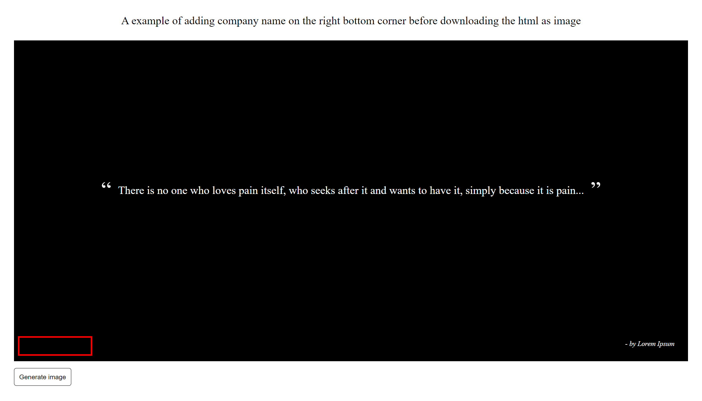

# Add Company Name before Downloading the HTML as Image

Before adding company name

---

Downloaded image after adding company name

---

## To Start Application Locally

In the project directory, you can run:

### `npm start`

Runs the app in the development mode.\
Open [http://localhost:3000](http://localhost:3000) to view it in the browser.

The page will reload if you make edits.\
You will also see any lint errors in the console.

---

This project was bootstrapped with [Create React App](https://github.com/facebook/create-react-app).
